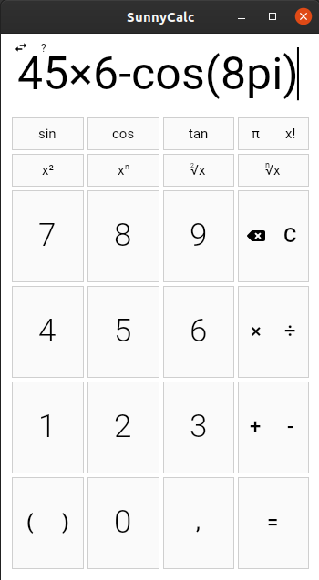

# IVS-proj2 | SunnyCalc

A calculator created for the [second project](http://ivs.fit.vutbr.cz/projekt-2_tymova_spoluprace2019-20.html) in the [IVS course](https://www.fit.vut.cz/study/course/13372/.en).

  

## Project structure

The project consists of the following parts:
- `SunnyCalc.Maths`: a custom mathematics library that can perform basic calculations and expression solving,
- `SunnyCalc.Maths.Tests`: unit tests for the mathematics library implementation,
- `SunnyCalc.Profiling`: a console app used for profiling the mathematics library (see below),
- `SunnyCalc.App`: the calculator app written using the [Avalonia](https://avaloniaui.net/) UI framework.

The `src` directory also contains:
- Doxygen files to generate HTML documentation for the app and the library,
- a Makefile (see below),
- an InnoSetup script to generate a Windows installer.

## Building

The whole project is written in C#, using .NET Core 3.1 and its tools. You can either
use your IDE of choice (like Visual Studio or Rider) to build the project or the dotnet
CLI may be used in the typical manner.

A Makefile for GNU Make is included that encapsulates the typical actions performed on the project. You can run one of the following targets:
- `make run` to run the calculator,
- `make test` to run the maths library tests, 
- `make app` to build the calculator and to publish different types of packages,
- `make profile` to build and publish the profiler app,
- `make doc` to generate the documentation.

The `app` and `profile` targets will publish a runtime-dependent package for running with `dotnet run`, runtime-dependent single-file executables for x64 Linux and x64 Windows that can be run on a machine with the runtime installed and self-contained single-file executables that contain the runtime packed in them.

## Running and installation

The `make app` target generates self-contained executables that can be run with no further out-of-the-ordinary dependencies on Windows and Linux (both x86-64 only). The calculator can also be run by invoking `make run` in the `src` directory or `dotnet run` in the `src/SunnyCalc.App` directory.

The Windows installer can be built using InnoSetup and the `WindowsInstaller.iss` script in the `src` directory. Executing the created binary will run the step-by-step installer, which is self-explanatory.

## Usage

## Profiling

The `SunnyCalc.Profiling` project contains a simple utility that calculates variance of a set of numbers.
The project also contains a simple integrated profiler. It can be used in two modes.

By default, it is supposed to be used with external profiling tools. It behaves as defined in the project specification.
The executable consumes floating-point numbers from _stdin_ until it reaches `EOF`.
(One number per line, lines that don't contain a number are ignored.)
Then it calculates the variance of the input numbers and outputs it to _stdout_ (the number is formatted using current system culture settings).
 
If the program is run with a `-s [file]` argument, the integrated profiler is enabled.
It will output the profiling results to the specified file, or to _stderr_ if `-` is used as the file name.
Both using the operation methods directly (the default calculation mode) and the expression solver are run and measured.

If the program is run with a `-e` argument, the calculation is performed using the expression solver, instead of using the operation methods
directly. The `-e` flag cannot be combined with the `-s` flag, as the `-s` flag measures the expression solver time anyway.

In both cases, the program will read its input from a file instead of reading from _stdin_ when a file name
is supplied as the _last_ argument.

## Supported platforms

- Ubuntu 64bit
- Windows 64bit

## Authors
#### Pracovní skupina Sluníčka
František Nečas (xnecas27) \
Ondřej Ondryáš (xondry02) \
David Chocholatý (xchoch08)

## License

SunnyCalc: A simple calculator software \
Copyright (C) 2020 František Nečas, David Chocholatý, Ondřej Ondryáš

This program is free software: you can redistribute it and/or modify
it under the terms of the GNU General Public License as published by
the Free Software Foundation, either version 3 of the License, or
(at your option) any later version.

This program is distributed in the hope that it will be useful,
but WITHOUT ANY WARRANTY; without even the implied warranty of
MERCHANTABILITY or FITNESS FOR A PARTICULAR PURPOSE.  See the
GNU General Public License for more details.
